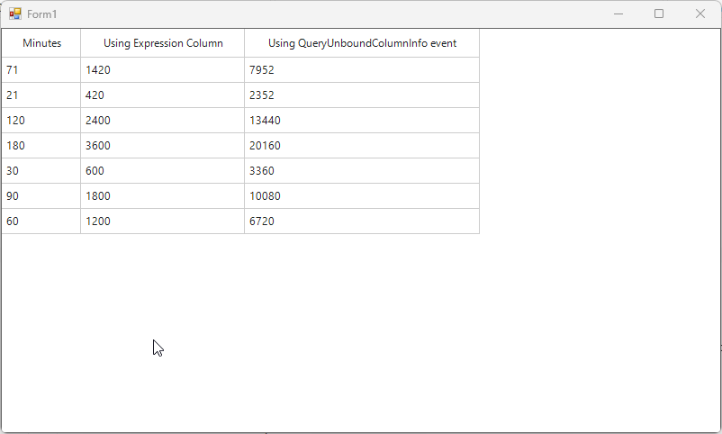

# How to add GridUnboundColumn when using DataTable as DataSource in WinForms DataGrid (SfDataGrid)?

In [WinForms SfDataGrid](https://www.syncfusion.com/winforms-ui-controls/datagrid), when you add a [GridUnboundColumn](https://help.syncfusion.com/cr/windowsforms/Syncfusion.WinForms.DataGrid.GridUnboundColumn.html) with an **Expression** or **Format** to calculate values for the column while the data source is set to a **DataTable**, it is not supported, and an exception is thrown internally. This is the expected behavior.

To overcome this limitation, you can use one of the following solutions:

**Solution 1**

If you want to use a [GridUnboundColumn](https://help.syncfusion.com/cr/windowsforms/Syncfusion.WinForms.DataGrid.GridUnboundColumn.html) to display calculated or derived values, you can achieve this by handling the **SfDataGrid.QueryUnboundColumnInfo** event.

First, create a GridUnboundColumn with a mapping name and header text. Then, within the event handler, set the cell value based on the required expression or calculation.

**C#**
```csharp
// Adding unbound column to SfDataGrid 
 sfDataGrid1.Columns.Add(new GridUnboundColumn
{
    MappingName = "unBoundColumn",
    HeaderText = "Using QueryUnboundColumnInfo event",
    AllowEditing = false,
    AllowFiltering = false,
    AllowSorting = false,
    AllowGrouping = false,
});

// Subscribe to QueryUnboundColumnInfo event
sfDataGrid1.QueryUnboundColumnInfo += SfDataGrid1_QueryUnboundColumnInfo;

 private void SfDataGrid1_QueryUnboundColumnInfo(object sender, Syncfusion.WinForms.DataGrid.Events.QueryUnboundColumnInfoArgs e)
 {
     if (e.UnboundAction == UnboundActions.QueryData)
     {
         var totalMin = Convert.ToDouble((e.Record as DataRowView).Row["total_minute"]);
         var save = totalMin * 112;
         e.Value = save.ToString();
     }
 }
```
**Note:** When using the QueryUnboundColumnInfo event to set cell values for a GridUnboundColumn, data operations such as sorting, filtering, grouping, and editing are not supported, as this is a limitation.

**Solution 2**

You can use an **Expression column**. While creating columns in the **DataTable**, you can define the expression as the **third parameter**, similar to using the GridUnboundColumn.Expression property. This creates an expression column that displays values based on the defined calculation.

You can then use this column name as the mapping name for SfDataGrid.Columns (such as GridTextColumn, GridNumericColumn, etc.).

However, using a **GridUnboundColumn** in this case will not display values as expected, because it does not automatically read values from the data source.

**C#**
```csharp
// Add an expression column
  table.Columns.Add("grand_total", typeof(string), "total_minute * 20");

 // Adding expression column to SfDataGrid
 sfDataGrid1.Columns.Add(new GridTextColumn
 {
     MappingName = "grand_total",
     HeaderText = "Using Expression Column",
     AllowEditing = false,
 });
```

**Note:** An expression column in a WinForms DataTable is always read-only. Its value is automatically calculated based on the defined expression, so it cannot be assigned manually.



Take a moment to peruse the [WinForms DataGrid - UnBoundColumn](https://help.syncfusion.com/windowsforms/datagrid/unboundcolumn) documentation, to learn more about unbound column with example.